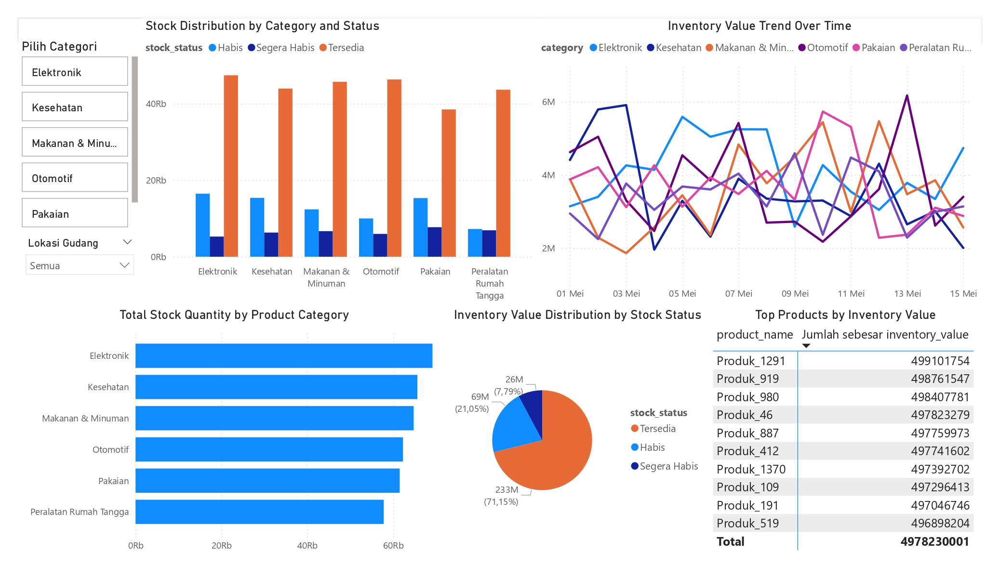

# Portofolio Power BI - Dashboard Manajemen Inventaris

## Gambaran Umum
Repositori ini menampilkan dashboard Power BI yang dirancang untuk menganalisis data inventaris bisnis. Dashboard ini memberikan wawasan tentang jumlah stok, nilai inventaris, dan tren berdasarkan kategori produk, lokasi gudang, dan status stok. Proyek ini menunjukkan kemampuan dalam visualisasi data, pembuatan dashboard interaktif, dan analisis data menggunakan Power BI.

## Dataset
Dataset berisi 1.500 entri dengan kolom berikut:
- `product_id`: ID unik untuk setiap produk.
- `product_name`: Nama produk.
- `category`: Kategori produk.
- `stock_quantity`: Jumlah stok barang.
- `warehouse_location`: Lokasi gudang penyimpanan.
- `stock_status`: Status stok (misalnya, Tersedia, Habis).
- `inventory_value`: Nilai moneter inventaris.
- `date_updated`: Tanggal pembaruan terakhir inventaris.

## Pertanyaan Bisnis yang Dijawab
Dashboard ini menjawab enam pertanyaan bisnis berikut melalui visualisasi interaktif:

1. **Kategori produk mana yang memiliki stok terbanyak?**
   - **Visualisasi**: Clustered Bar Chart
   - **Detail**: Menampilkan total jumlah stok per kategori, dengan filter interaktif berdasarkan lokasi gudang.
   - **Manfaat**: Mengidentifikasi kategori yang kelebihan stok untuk perencanaan strategi penjualan.

2. **Bagaimana distribusi nilai inventaris berdasarkan status stok?**
   - **Visualisasi**: Pie Chart
   - **Detail**: Menunjukkan proporsi nilai inventaris berdasarkan status stok (misalnya, Tersedia, Habis), dengan filter kategori.
   - **Manfaat**: Mengungkap nilai inventaris yang terkunci di stok tidak tersedia.

3. **Bagaimana tren nilai inventaris dari waktu ke waktu?**
   - **Visualisasi**: Line Chart
   - **Detail**: Melacak nilai inventaris dari waktu ke waktu, dengan opsi breakdown per kategori dan filter lokasi gudang.
   - **Manfaat**: Menunjukkan apakah nilai inventaris meningkat atau menurun.

4. **Lokasi gudang mana yang menyimpan stok terbanyak?**
   - **Visualisasi**: Clustered Column Chart
   - **Detail**: Menampilkan jumlah stok berdasarkan lokasi gudang, dengan filter kategori.
   - **Manfaat**: Mengidentifikasi gudang dengan stok tinggi atau rendah.

5. **Produk mana yang memiliki nilai inventaris tertinggi?**
   - **Visualisasi**: Table/Matrix
   - **Detail**: Daftar produk diurutkan berdasarkan nilai inventaris, dengan filter kategori dan status stok.
   - **Manfaat**: Menyoroti produk bernilai tinggi untuk fokus manajemen inventaris.

6. **Bagaimana distribusi stok berdasarkan kategori dan status stok?**
   - **Visualisasi**: Stacked Bar Chart
   - **Detail**: Menampilkan jumlah stok per kategori, dipisahkan berdasarkan status stok, dengan filter lokasi gudang.
   - **Manfaat**: Menunjukkan pola ketersediaan stok di setiap kategori.

## Visualisasi
Berikut adalah pratinjau dashboard:

Untuk tampilan statis, unduh versi PDF: [powerbi-portofolio.pdf](powerbi-portofolio.pdf)

## Alat yang Digunakan
- **Power BI Desktop**: Untuk membuat dan mendesain dashboard.
- **Dataset**: Data inventaris simulasi (1.500 entri).
- **Visualisasi**: Clustered Bar Chart, Pie Chart, Line Chart, Clustered Column Chart, Table/Matrix, Stacked Bar Chart.